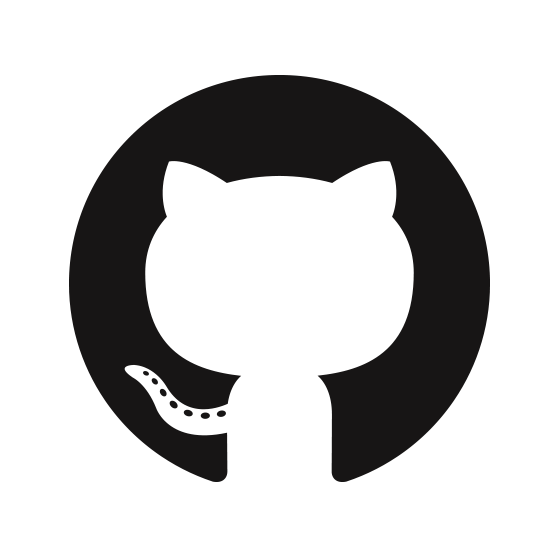

==================================
Resume - Vinay Keerthi K. T.
==================================

.. |date| date::

.. footer::

    **BE Mechanical Engineering (2010)**

    |mail| `ktvkvinaykeerthi@gmail.com <mailto:ktvkvinaykeerthi@gmail.com>`_ |
    **Phone:** +91 9538689544|
    |github| `stonecharioteer <https://github.com/stonecharioteer>`_ |
    |web| `tech.stonecharioteer.com <https://tech.stonecharioteer.com/>`_ |

    *Autogenerated from an rst file on* |date| *using Python.*

-----

Lead Backend & Data Engineer with 12+ years of experience designing scalable systems,
streaming data pipelines, and developer tooling. Impeccable writer with skills to reach
the frontpage of HackerNews *thrice* in a month with an acument to break things down
and explain concepts with ease.

---------------------------
Key Skills
---------------------------

* Languages: Python (primary), Rust, JavaScript, Ruby
* Frameworks & Tools: Django, Express, Pydantic, FastAPI, Ruby on Rails
* Data & Infra: Kafka, Spark, Airflow, Redis
* Cloud: AWS (S3, EC2, IAM), GCP (BigQuery, Cloud Function)
* LLM & GenAI: MCP (Model Context Protocol), Ollama, Claude Code, LM-Studio, LangChain
* DevOps & Ops: Linux (daily driver since 2005), Docker, K8s, CI/CD pipelines, Monitoring & Alerting (Prometheus, Grafana, InfluxDB)

------------------------------------
Experience 
------------------------------------

Chatwoot
-------------------
Engineering Lead | **Bangalore; Remote** | **September 2025**

* Cut down response times by 40% through identifying unused indices in PostgreSQL database.
* Led the team on the rollout of critical features, such as an advanced editor
  to improve user experience, and a companies feature that showcased the
  different domains users' customers would login from.
* Set up generation of local data to test the database performance.
* Led the cleanup of our Sentry dashboards, improving on-call response time and
  lowering the cost of monitoring.

Composio
------------------------------
Consultant | **Bangalore** | **May 2025 - June 2025**

* Consulted with the company on scaling their AI tool solution.
* Completely overhauled the python SDK for usability and MCP support.

ChainSafe
-------------------------------

**Lead Software Developer** | **Bangalore** | **November 2022 - February 2025**

* Spearheaded Python-based developer tooling for data pipelines, accounting,
  and blockchain event tracking using Dagster and Redis.
* Evaluated and integrated **GenAI tools (ChatGPT, LLaMA 3.1)** to streamline
  internal workflows, automate reports, and improve project hygiene.
* Built chat-based LLM assistants using **Ollama** and **ChromaDB** to track
  OKRs and assist in smart contract self-audits.
* Developed dashboards and monitoring scripts for EVM wallet health, enabling
  cross-chain alerting.
* Reviewed Rust contributions across teams and supported integration of libp2p
  in blockchain networking libraries.
* Led a cross-functional team of 4; provided technical and career mentorship,
  ran agile sprints, and interfaced with external stakeholders.

Merkle Science
-------------------------------

**Lead Software Developer** | **Bangalore** | **JULY 2021 - November 2022**

* Built and led a team focused on internal data infrastructure and developer
  tooling.
* Prototyped a **Kafka + PySpark pipeline** to process high-velocity blockchain
  transactions for compliance use cases.
* Designed and maintained **Rust libraries** for blockchain ingestion,
  including Python bindings via PyO3.
* Created a CLI toolkit for data movement and quality assurance, integrating
  with **Airflow** and cloud object stores.
* Modernized **Airflow DAGs** using a modular, testable design with Poetry and
  Docker-based dev environments.
* Maintained the **Django** backend for customer-facing dashboards and
  compliance rule engines.
* Designed internal alerting and load-balancing systems for high-availability
  blockchain node RPCs.

-----------------
VISA Inc.
-----------------

**Sr. Software Engineer - Data Platform** | **Bangalore** | **MAY 2019 - June 2021**

* Led development of internal tools for secure server orchestration, onboarding
  automation, and PCI-compliant infrastructure workflows.
* Built a CLI-driven deployment framework for the Platform-as-a-Service (PaaS)
  team, tailored to Visa’s internal systems — combining aspects of Ansible with
  custom workflows.
* Created dashboards to visualize engineering productivity and Git activity
  across global teams during the COVID-19 transition.
* Developed Python-based automation for CI/CD pipelines, audit logging, and
  access provisioning.
* Mentored junior engineers and interns; led Python workshops and cross-team
  code review sessions to standardize engineering practices.

GKN Aerospace India
--------------------

**Software Engineer** | **Bangalore** | **DEC 2015 - MAY 2019**

* Built internal search tools, GPU-accelerated Python libraries, and managed CI/CD pipelines.

Flipkart Internet Pvt. Ltd.
-------------------------------

**Bangalore** | **FEB 2014 - DEC 2015**

* Developed automation tools in Python for content workflows and marketing campaigns.

------------------------
Side Projects
------------------------
* Two of my articles hit the HackerNews front page: `Ruby Blocks <https://tech.stonecharioteer.com/posts/2025/ruby-blocks/>`_ and `Some Smalltalk about Ruby Loops <https://tech.stonecharioteer.com/posts/2025/ruby-loops/>`_
* `GoForGo - An interactive way to learn Go <https://github.com/stonecharioteer/goforgo>`_
* `Read the RFCs that Built the Internet <https://rfc.stonecharioteer.com>`_

------------------------
Public Speaking
------------------------
* Fifth Elephant 2025 — Emcee for the AI Agentic Track
* HasGeek Rootconf 2022 — `Is Rust Ready for Enterprise Adoption? (Birds of a Feather) <https://hasgeek.com/rootconf/is-rust-ready-for-enterprise-adoption/sub/is-rust-language-ready-for-enterprise-adoption-sum-54yCDYud7csgx3sbT9GAFd>`_
* Bangalore Python Meetup 2022 — `Rust for Pythonistas <https://www.youtube.com/watch?v=62yfBiHrUis>`_ and `Web Security with Flask & OWASP <https://www.youtube.com/watch?v=xickNijifOs>`_
* PyCon India 2019 — MicroPython: Building a Physical Inventory Search Engine

----------------------
Other Experience
----------------------

* **FEB 2011 - FEB 2014** TVS Group & IISc internships — Worked on statistical quality control and composite material analysis using Python

-----

